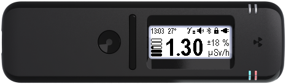

# Appointment of the device

## Appointment of the device

<mark style="color:green;">Purpose of the device</mark>

This section contains the general information about dosimeter Radiacode-10X series. Later in the document, the dosimeter Radiacode-10X series is also referred to as "device" and "dosimeter".


Attention! This user manual is valid for devices with firmware version from 4.11


The developer is constantly improving the firmware of the device, therefore it is recommended to always use the latest version of the user manual. The latest information can be found at the links in the section: [Device info](../info/device-info.md)

<figure><figcaption></figcaption></figure>

Portable dosimeter personal radiation detector Radiacode-10X series is designed to assess the radiation situation in real time. In addition, the instrument automatically keeps a log of measurement results and events. This makes it possible to analyze them, including with the help of standard software on a smartphone or personal computer. The dosimeter is suitable for work on the ground, with samples of construction materials, with specially selected and prepared food or soil samples.

The instrument has high sensitivity to gamma and X-ray radiation.\
It is suitable for assessing dose rate, accumulated dose, absorbed radiation energy spectrum and radiation hazard warning.

Personal radiation detector Radiacode-10X series is a universal tool for radiation safety assessment. With it, it is always available for:\
site reconnaissance;\
· inspection of objects and materials;

· continuous monitoring of the radiation situation;\
· automatic data storage in the instrument's memory;\
· accumulated dose monitoring;\
· quick search for radiation sources;\
· two-channel alarm signaling of radiation danger and changes in the radiation situation; · time-based database;\
· possibility of autonomous operation, or in pair with a smartphone;\
· wireless data transmission;\
· wide possibilities of data processing in Windows, Android and IOS applications.

**Radiacode-10X series is a highly sophisticated and sensitive instrument. Please read the instructions to obtain reliable results.**

