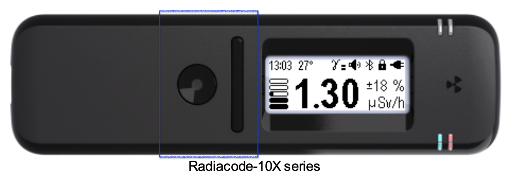

# Buttons

## Buttons

<figure><figcaption></figcaption></figure>

| The device is |                                    in the left hand | in the right hand                                   |
| ------------- | --------------------------------------------------: | --------------------------------------------------- |
|               |  |  |

1. round button for turning on and confirming;
2. swing button "down";
3. swing button "up".

There are two types of pressing the buttons: _short_ and _long_ (at least two seconds). A long press on the round button \[1] is used to

* turn on the instrument;
* unlock the swing buttons;
* call up the menu;
* confirm viewing of the presented list of maximum alarm levels;
* in some setup screens.

A short press of the round button is used to:

* to lock the swing buttons;
* return from the main menu to the display mode;
* confirm selection of the highlighted menu item;
* toggle the selection options.
* to turn off the alarms.

To include Radiacode-10X series click on round button and hold it down for three seconds.

The device can be switched off via the menu.

##
