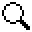
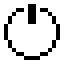
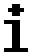

# Menu usage

## Menu usage

The Radiacode-10X series dosimeter has a single mode of operation - continuous data collection, accumulation and analysis.

|                                                     |                                                                                                                                                                                                                                                                                                                                                                                                 |                                                        |
| --------------------------------------------------- | ----------------------------------------------------------------------------------------------------------------------------------------------------------------------------------------------------------------------------------------------------------------------------------------------------------------------------------------------------------------------------------------------- | ------------------------------------------------------ |
|        | 
- Press and hold the <a href="buttons.md">round button</a> until the instrument turns on (at least 3 seconds);  - When turned on, the instrument will be in the Monitor and display the dose rate; - With the appropriate settings, the sound power on will be played at this time. - At appropriate settings at this moment the backlight of the display will be turned on.
 |    |
|  | 
Press and hold the round button to move to the menu;  - The name of the current menu item will be displayed at the top. (In this case it is "Monitor" <a href="menu-usage.md#monitor">Display Modes</a>); - The icons of the main menu items will be placed vertically; - The active item will be highlighted with a negative icon
                                           |  |

<table><thead><tr><th>Symbol</th><th>Function</th><th>About</th><th data-hidden></th></tr></thead><tbody><tr><td></td><td><em>Settings</em></td><td>Instrument Settings menu.</td><td></td></tr><tr><td></td><td><em>Spectrum</em></td><td>Display of the energy spectrum of radiation.</td><td></td></tr><tr><td></td><td><em>Monitor</em></td><td>Display the current dose rate or count rate.</td><td></td></tr><tr><td></td><td><em>Dose</em></td><td>Display of accumulated dose of photon radiation (gamma and X-ray).</td><td></td></tr><tr><td></td><td><em>Search</em></td><td>Search mode - display the count rate as a graph.</td><td></td></tr><tr><td></td><td><em>Power off</em></td><td>Turning off the device.</td><td></td></tr><tr><td></td><td><em>About device</em></td><td>Information about the dosimeter serial number and software version.</td><td></td></tr></tbody></table>

At any moment one of several ways of displaying the radiation situation assessment is available:

 \[\[[#Monitor](menu-usage.md#monitor) – estimation of dose rate and count rate; \[\[#[Dose](menu-usage.md#dose)]] – dose assessment;  \[\[#[Search](menu-usage.md#search)]]– operational search;  \[\[#[Spectrum](menu-usage.md#spectrum)]] –  energy spectrum of photon radiation.

During operation, the instrument also detects the exceeding of all Alarms levels. Informs the user of radiation hazards or changes in the environment.

Use a short press on the up/down swing buttons to select the desired item. The selected item will be highlighted with a negative icon. To confirm the selection, use a short press on the round button. Only three selections are available on the instrument screen at a time, the others will become available when the up/down swing buttons are pressed again.

Of the seven items, four \[ Spectrum,  Monitor,  Dose,  Search] give access to the selection of the radiation situation display mode.

Item \[  Power off] – is an action point, if it is confirmed with the round button, the instrument will be switched off.

Item \[  Settings] is used to go to the submenu of the instrument settings.\
Item \[  About device] is used to obtain information about the instrument number and firmware and

bootloader versions.

At all levels, the menu is arranged in a cyclical fashion. For example, on the main level, pressing the down swing button moves the focus from item to item in the following order:  --> --> --> -->-->-->-->

