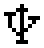
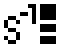

# 6 Signals   sound, vibration, light

!\[\[sound\_on\_sym.png]] !\[\[sound\_off\_sym.png]]

Portable radiation detector Radiacode-10X series is equipped with a combined interface for user interaction:

* display;
* buttons;
* sound emitter;
* LEDs;
* vibration signaling device. Sound, light, vibration complement the information presented on the display and provide feedback when pressing the buttons.

| **Event/state**                                                                      | **Display**                                                                                                                                                                                        | **Sound** | **Vibration** | **Led/Backlight**    |
| ------------------------------------------------------------------------------------ | -------------------------------------------------------------------------------------------------------------------------------------------------------------------------------------------------- | --------- | ------------- | -------------------- |
| Switching on                                                                         | –                                                                                                                                                                                                  | +         | +             | –                    |
| Switching off                                                                        | –                                                                                                                                                                                                  | +         | –             | –                    |
| Establishing a connection                                                            | 
 
                                                                                 | +         | –             | –                    |
| Loss of connection                                                                   | –                                                                                                                                                                                                  | +         | –             | –                    |
| Low battery charge                                                                   |                                                                                                                                                  | +         | +             | –                    |
| Battery charge process                                                               |                                                                                                                                               | –         | –             | blue - continuous    |
| Device search                                                                        | –                                                                                                                                                                                                  | +         | +             | –                    |
| Pressing the button                                                                  | –                                                                                                                                                                                                  | +         | +             | –                    |
| Quantum registration                                                                 | –                                                                                                                                                                                                  | +         | –             | green, red - flashes |
| Alarm 1                                                                              | 
,  , 
 | +         | +             | screen backlight     |
| Alarm 1                                                                              | 
,  , 
             | +         | +             | screen backlight     |
| Out of scale                                                                         | 
, 

, 
       | +         | +             | screen backlight     |
| In the menu you can select the operation mode of sound, light and vibration alarms.  |                                                                                                                                                                                                    |           |               |                      |

Separate permissions to play alarm sounds, buttons, clicks are available.

| .png>)                          | 
- Briefly press the up/down rocker buttons to move the focus to <strong>[Signals]</strong>; - Short press the round button to move the focus to <strong>[Signals].</strong>
                                                                                                                                                                                                 | .png>)                        |
| ----------------------------------------------------------------------------------------------- | ------------------------------------------------------------------------------------------------------------------------------------------------------------------------------------------------------------------------------------------------------------------------------------------------------------------------------------------------------------------------------------- | ------------------------------------------------------------------------------------------------ |
| .png>) | 
- Briefly press the up/down swing buttons to move the focus to the item <strong>[Sound]</strong>; - Short presses on the round button to select the sound signaling mode:<strong>[On]</strong> - all allowed sounds;<strong>[Off]</strong> - only the sounds of searching for the instrument and going out of the measuring scale remain, if it is allowed by the settings.
 | .png>) |
| .png>)            | 
- Vibration and light modes can be set in the same way:  - Move the focus to <strong>[Vibro]</strong> or <strong>[Light]</strong> by short presses on the up/down swing buttons; - Short presses on the round button to select the <strong>[On]</strong> or <strong>[Off]</strong> mode.
                                                                              |                    |
|                   | 
- The presence of gamma and X-ray photon registration clicks can be controlled separately. - By short presses on the up/down swing buttons move the focus to the item <strong>[Clicks]</strong>; - Short presses on the round button to select the <strong>[On]</strong> or <strong>[Off]</strong> mode.
                                                                 |                   |
|                    | 
- Briefly press the up/down swing buttons to move the focus to the <strong>[Buttons]</strong>; - Short press the up/down swing buttons to move the focus to <strong>[Buttons]</strong> or <strong>[Vibro]</strong>; - Short press the round button to select the desired response type.
                                                                                  | .png>) |

|            | 
- Separately, you can control the presence of the device connection and disconnection signal.  - Briefly press the up/down swing buttons to move the focus to <strong>[Connection]</strong>; - Short press the round button to select**[On]** or <strong>[Off].</strong>
 |   |
| --------------------------------------------------------------------------------------- | ---------------------------------------------------------------------------------------------------------------------------------------------------------------------------------------------------------------------------------------------------------------------------------------- | - |
|               | 
- The presence of the on/off signal can be controlled separately.  - Short press the up/down swing buttons to move the focus to <strong>[Power]</strong>; - Short press the round button to select**[On]** or <strong>[Off].</strong>
                                    |   |
|              | 
- To set the alarms, move the focus to <strong>[Alarms]</strong>; - Press the round button briefly to confirm your selection.
                                                                                                                                                  |   |
|                      | - Short presses on the round button to select the alarm indication mode\*\*\[One-shot]\*\* or **\[Continuous]**.                                                                                                                                                                         |   |
|  | 
- To select an alarm channel, move the focus to the desired item, e.g. <strong>[Dose rate]</strong>; - Press the round button briefly to confirm your selection.
                                                                                                               |   |
|    | 
- Briefly press the up/down swing buttons to move the focus to the desired alarm level**[Alarm 1]** or <strong>[Alarm 2]</strong>; - Press the round button briefly to confirm your selection.
                                                                                 |   |

|           | 
- Short press the up/down swing buttons to move the focus to <strong>[Sound]</strong> or <strong>[Vibration]</strong>; - Short press the round button to select**[On]** or <strong>[Off]</strong>;
                                                        |               |
| --------------------------------------------------------------------------------------- | ------------------------------------------------------------------------------------------------------------------------------------------------------------------------------------------------------------------------------------------------------------------- | ------------------------------------------------------------------------------------------- |
|  | 
- To return to the previous level or exit the menu, briefly press the up/down swing buttons to move the focus to <strong>[&#x3C; Back]</strong> or <strong>[&#x3C;&#x3C; Menu quit]</strong>; - Briefly press the round button to confirm your selection.
 |  |
