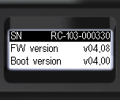

# Device info

The mode is intended for presenting brief information about the device:

* Instrument model and serial number;
* Firmware version;
* Bootloader version;
* FCC ID. _\*Not specified for all devices_

<figure><figcaption></figcaption></figure>

<figure><figcaption></figcaption></figure>
