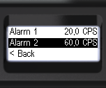
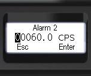
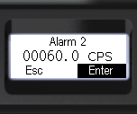
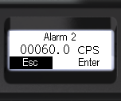

# 2 Count rate   alarm levels

  .png>)

> About this display mode see [#search](../display/#search "mention")

| .png>)                                | 
- Briefly press the up/down rocker buttons to move the focus to <strong>[Count rate]</strong>; - Short press the round button to moveto <strong>[Count rate]</strong>.<strong>]</strong>;
                                                                  |                                     |
| ----------------------------------------------------------------------------------------------------- | -------------------------------------------------------------------------------------------------------------------------------------------------------------------------------------------------------------------------------------------------------------------- | ---------------------------------------------------------------------------------------------------- |
|                        | 
- Short press the round button to move to**[Alarm 1]**; - Short press the round button to select the desired digit of the threshold value; - Short presses on the up/down swing buttons to change the value of the selected digit; - Set all digits;
 |                    |
|  | 
- Short presses on the round button to select <strong>[Enter]</strong> or <strong>[Esc]</strong>; - Long press the round button to confirm your selection;
                                                                                                 |  |
|                                                                                                       | This and deeper menu levels can be exited via **\[< Back]** and **\[<< Menu quit]**.or go to **\[Alarm 2]**                                                                                                                                                          |                                                                                                      |

<table data-header-hidden><thead><tr><th width="249"></th><th></th><th></th></tr></thead><tbody><tr><td></td><td>- Short press the round button to move to**[Alarm 2]**; - Short press the round button to select the desired digit of the threshold value; - Short presses on the up/down swing buttons to change the value of the selected digit; - Set all digits;</td><td></td></tr><tr><td></td><td>- Short presses on the round button to select <strong>[Enter]</strong> or <strong>[Esc]</strong>; - Long press the round button to confirm your selection;</td><td></td></tr><tr><td> </td><td>- To return to the previous level or exit the menu, briefly press the up/down swing buttons to move the focus to <strong>[&#x3C; Back]</strong> or <strong>[&#x3C;&#x3C; Menu quit]</strong>; - Briefly press the round button to confirm your selection;</td><td></td></tr></tbody></table>
