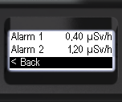
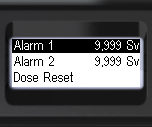
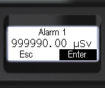
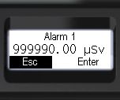

# 4 Dose   alarm levels

 .png>)

> \[!note] About this display mode see [#dose](../display/#dose "mention")

<table data-header-hidden><thead><tr><th width="249"></th><th></th><th></th></tr></thead><tbody><tr><td></td><td>- Briefly press the up/down rocker buttons to move the focus to <strong>[Dose]</strong>; - Short press the round button to moveto <strong>[Dose]</strong>.</td><td></td></tr><tr><td></td><td>- Short press the round button to move to**[Alarm 1]**; - Short press the round button to select the desired digit of the threshold value; - Short presses on the up/down swing buttons to change the value of the selected digit; - Set all digits.</td><td></td></tr><tr><td></td><td>- Short presses on the round button to select <strong>[Enter]</strong> or <strong>[Esc]</strong>; - Long press the round button to confirm your selection.</td><td></td></tr></tbody></table>

This and deeper menu levels can be exited via **\[< Back]** and **\[<< Menu quit]**.or go to **\[Alarm 2]**.

|                        | 
- Short press the round button to move to**[Alarm 2]**; - Short press the round button to select the desired digit of the threshold value; - Short presses on the up/down swing buttons to change the value of the selected digit; - Set all digits.
 |                    |
| ---------------------------------------------------------------------------------------------- | -------------------------------------------------------------------------------------------------------------------------------------------------------------------------------------------------------------------------------------------------------------------- | --------------------------------------------------------------------------------------------- |
|  | 
- Short presses on the round button to select <strong>[Enter]</strong> or <strong>[Esc]</strong>; - Long press the round button to confirm your selection.
                                                                                                 |  |
| .png>)                              | 
- To return to the previous level or exit the menu, briefly press the up/down swing buttons to move the focus to <strong>[&#x3C; Back]</strong> or <strong>[&#x3C;&#x3C; Menu quit]</strong>; - Briefly press the round button to confirm your selection.
  | 

  |
