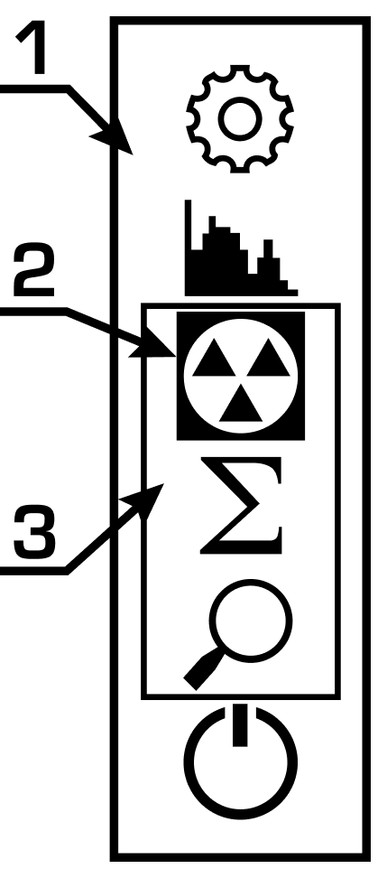

# Display Modes

Before using Radiacode device for the first time, charge it for two hours.

To turn on the device, press the round button and hold it for 3 seconds. After display turning-on and sound signalling the device comes into working state.

The dosimeter continuously estimates an ambient dose equivalent rate (AEDR), event count rate, energy spectrum of absorbed photon radiation, and also accumulates an estimation of the ambient dose equivalent (AED). Using a menu of the device, you can view any of these parameters on the display.

<figure><figcaption></figcaption></figure>

####
