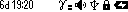

# Dose

#### Dose

The mode is intended for presentation of accumulated dose.

In the Dose display mode the screen shows:

* status panel - from the top;
* parameters of accumulated dose estimation.

The upper part of the screen, from left to right, contains basic information about the status of the instrument:

<figure><figcaption></figcaption></figure>

* time since the beginning of dose accumulation: days, hours, minutes;
* detector temperature;
* sign of exceeding the thresholds for dose rate, dose rate, count rate;
* audio indication status;
* presence of Bluetooth or USB connection;
* swing button lock sign;
* battery status.

At the bottom of the screen from left to right:

* graphical representation of the cumulative dose estimate.
* cumulative dose assessment value;
* dose measurement units - Sv, R;

Using the menu you can choose between the measurement units:

* Sv or P - when displaying dose rate.


<mark style="color:blue;">Quick control in this mode is available via the buttons:</mark>

* <mark style="color:blue;">long pressing the lower button resets the value of the accumulated dose;</mark>
* <mark style="color:blue;">long pressing on the upper button of the swing turns on and off the sound indication.</mark>


**Setting alarm thresholds**

####
