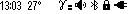

# Monitor

#### Monitor

This mode is intended to represent dose rate or count rate. When the instrument is turned on, it starts working in this particular display mode. All incoming data are accumulated and analyzed. If a change in the radiation situation is detected, the instrument starts a new interval of data accumulation. If there are no signs of changes in the radiation situation, the averaging continues in order to increase the reliability of the estimation. Statistical error in the Monitor mode is maintained at the level not more than 15% for the confidence interval 2δ at sufficient radiation intensity.

In the **Monitor** display mode, the screen shows:

* status panel - from the top;
* parameters of dose rate or count rate estimation - at the bottom. !\[\[presentation\_dose\_rate\_all\_signs\_f 1.png]] The upper part of the screen, from left to right, contains basic information about the status of the instrument:

<figure><figcaption></figcaption></figure>

* current time: hours, minutes;
* detector temperature;
* sign of exceeding the thresholds for dose rate, dose rate, count rate;
* audio indication status;
* presence of Bluetooth or USB connection;
* swing button lock sign;
* battery status.

At the bottom of the screen from left to right:

* graphical representation of the dose rate or count rate estimate;
* value of the dose rate or count rate estimate;
* value of random error in %;
* dose rate measurement units - Sv/h, R/h, or count rate - CPS, CPM.

With the help of the menu the choice between the measurement units is available:

* Sv/h or R/h - when displaying dose rate;
* CPS or CPM - when displaying the count rate.

The type of radiation intensity estimation: Dose rate or count rate can be selected in the menu, or can be switched operatively with the instrument buttons.

> <mark style="color:blue;">\[!todo] Quick control in this mode is available via the buttons:</mark>
>
> * <mark style="color:blue;">a short press on the top button of the swing to switch between the types of photon radiation intensity display:</mark>&#x20;
> * <mark style="color:blue;">dose rate or count rate;</mark>
> * <mark style="color:blue;">long pressing on the upper button of the swing turns on and off the sound indication;</mark>
> * <mark style="color:blue;">short pressing on the lower button of the swing switches on the sound indication of registered quanta (clicks).</mark>

####
