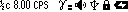

# Search

#### Search

The mode is designed to represent the count rate in the form of a search graph. It is applicable for operative search of the source or zone with increased radiation level.

In the Search display mode the screen shows:

* status bar - on top;
* search graph of count rate - at the bottom.

<figure><figcaption></figcaption></figure>

The upper part of the screen, from left to right, contains basic information about the status of the instrument:

<figure><figcaption></figcaption></figure>

* averaging time, price of one bar on the chart in seconds - 1/2, 1, 2, 4 seconds;
* current count rate value;
* count rate units - CPS or CPM;
* sign of exceeding thresholds on dose rate, dose rate, count rate level;
* audio indication status;
* Bluetooth or USB connection;
* swing buttons lock sign;
* battery status.

At the bottom of the screen from left to right:

* graphical representation of the current count rate.
* search graph of the count rate;


<mark style="color:blue;">Quick control in this mode is available via buttons:</mark>

* <mark style="color:blue;">a short press on the upper swing button increases the averaging time;</mark>
* <mark style="color:blue;">a short press on the lower swing button decreases the averaging time;</mark>
* <mark style="color:blue;">long press on the lower swing button clears the screen and starts a new search session;</mark>
* <mark style="color:blue;">long pressing the upper swing button turns the sound indication on and off.</mark>


####
