# Icons

In the menu (enter by long pressing the round button), the sections are indicated by icons and text. There are seven menu items available on the main menu level.

<table><thead><tr><th>Symbol</th><th>Function</th><th>About</th><th data-hidden></th></tr></thead><tbody><tr><td>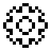</td><td><em>Settings</em></td><td>Instrument Settings menu.</td><td></td></tr><tr><td></td><td><em>Spectrum</em></td><td>Display of the energy spectrum of radiation.</td><td></td></tr><tr><td></td><td><em>Monitor</em></td><td>Display the current dose rate or count rate.</td><td></td></tr><tr><td></td><td><em>Dose</em></td><td>Display of accumulated dose of photon radiation (gamma and X-ray).</td><td></td></tr><tr><td>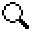</td><td><em>Search</em></td><td>Search mode - display the count rate as a graph.</td><td></td></tr><tr><td>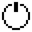</td><td><em>Power off</em></td><td>Turning off the device.</td><td></td></tr><tr><td></td><td><em>About device</em></td><td>Information about the dosimeter serial number and software version.</td><td></td></tr><tr><td></td><td></td><td></td><td></td></tr><tr><td>In all display modes except settings, the display shows a logarithmic indicator:</td><td></td><td></td><td></td></tr><tr><td>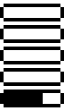</td><td></td><td></td><td></td></tr></tbody></table>

Each horizontal bar shows a graphical representation of a value (dose rate, dose, count rate) on a logarithmic scale. The ranges of the bars differ by a factor of 10. For example, for dose rate (µSv/h) the ranges will look as follows: !\[\[indicator\_levels\_sym.png]]

Various icons are used to label fields on the instrument status panel.

<table><thead><tr><th></th><th></th><th data-hidden></th></tr></thead><tbody><tr><td>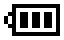</td><td>At least 60% charge.</td><td></td></tr><tr><td>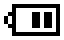</td><td>At least 30% charge.</td><td></td></tr><tr><td></td><td>At least 10% charge.</td><td></td></tr><tr><td></td><td>Less than 10% charge, the battery needs to be recharged.</td><td></td></tr><tr><td></td><td>The battery is being charged.</td><td></td></tr><tr><td>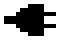</td><td>Charge completed, external power supply.</td><td></td></tr><tr><td></td><td>The "swing" buttons are locked.</td><td></td></tr><tr><td></td><td>USB communication has been established.</td><td></td></tr><tr><td>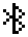</td><td>Bluetooth communication has been established.</td><td></td></tr><tr><td>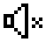</td><td>All sounds are off.</td><td></td></tr><tr><td>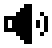</td><td>Sounds included.</td><td></td></tr><tr><td></td><td>Level 1 alarm on Count Rate.</td><td></td></tr><tr><td>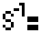</td><td>Level 2 alarm on Count Rate.</td><td></td></tr><tr><td></td><td>Count Rate over-range alarm.</td><td></td></tr><tr><td></td><td>Level 1 Dose Rate alarm.</td><td></td></tr><tr><td>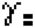</td><td>Level 2 Dose Rate alarm.</td><td></td></tr><tr><td>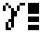</td><td>Dose Rate over-range alarm.</td><td></td></tr><tr><td></td><td>Level 1 alarm on Dose.</td><td></td></tr><tr><td></td><td>Level 2 alarm on Dose.</td><td></td></tr><tr><td></td><td>Dose off-scale alarm.</td><td></td></tr><tr><td>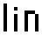</td><td>Linear scale of the amplitude of the energy spectrum of photon radiation.</td><td></td></tr><tr><td></td><td>Logarithmic scale of the amplitude of the energy spectrum of photon radiation.</td><td></td></tr></tbody></table>
